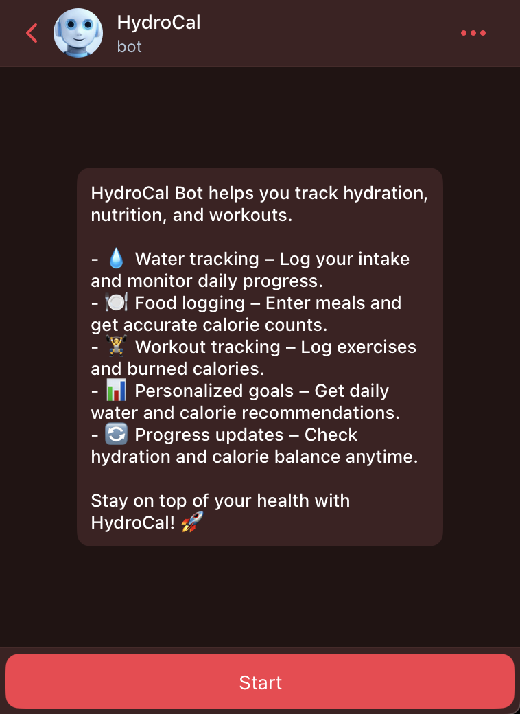
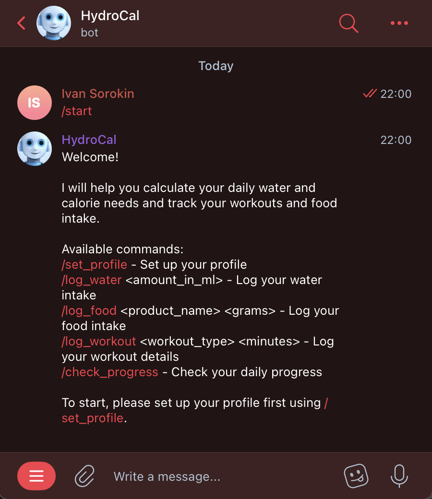
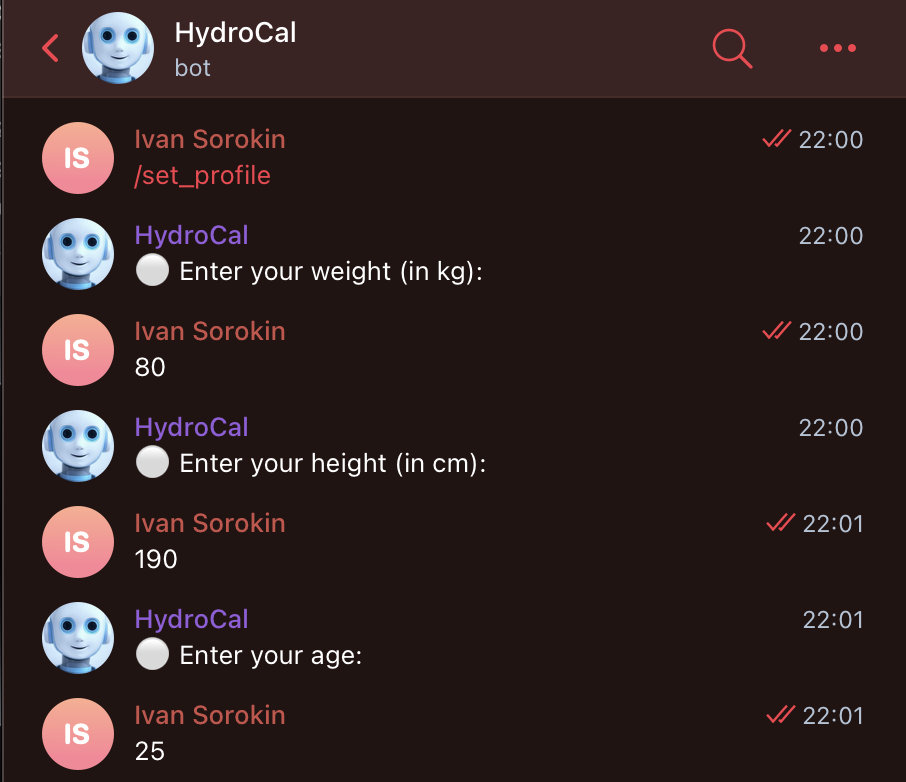
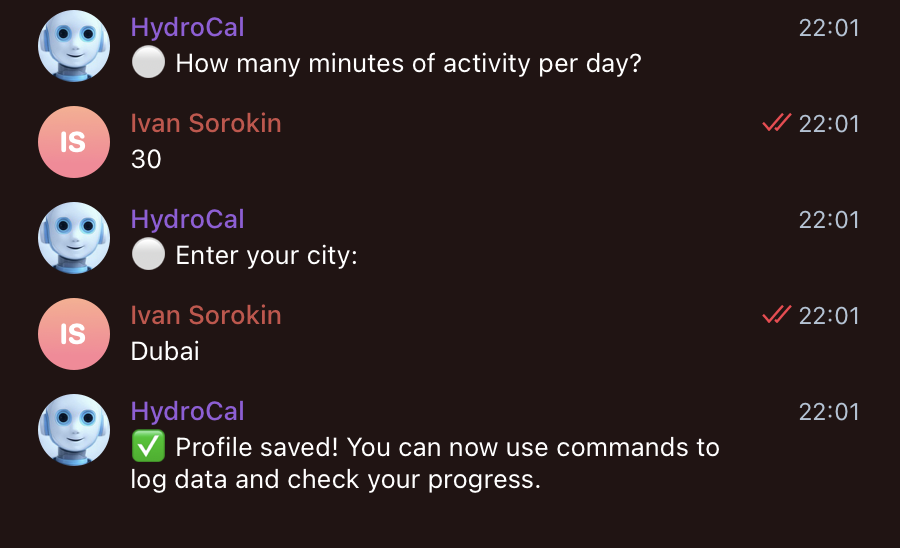
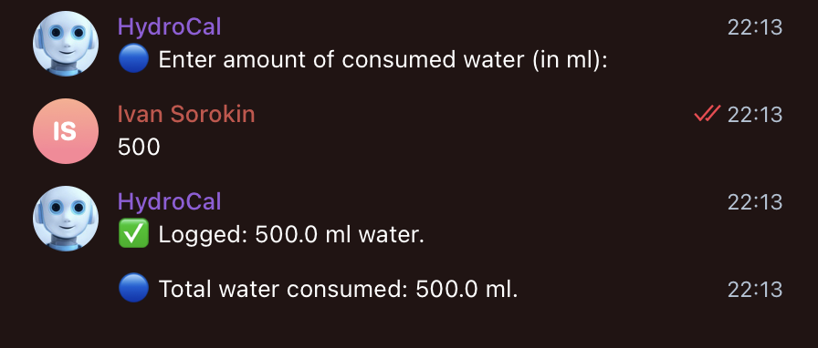
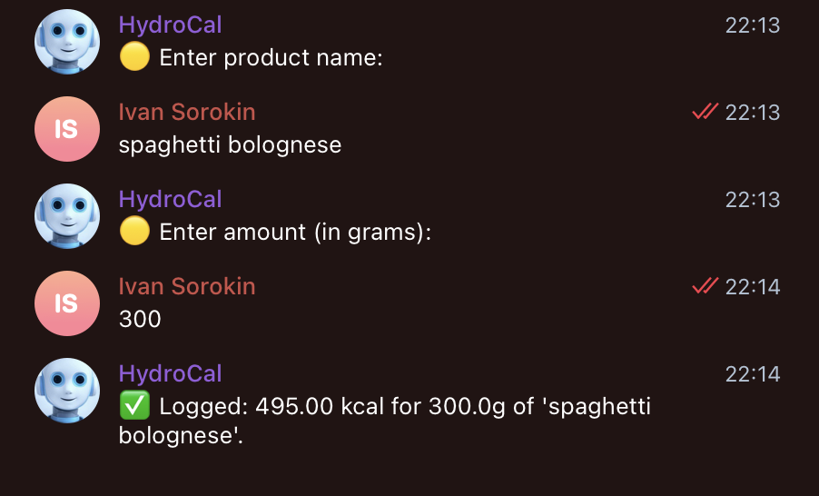
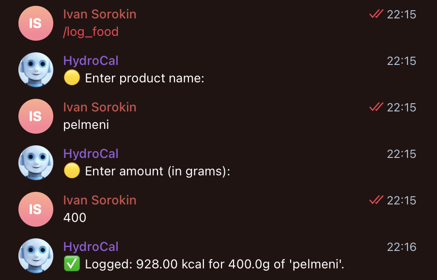
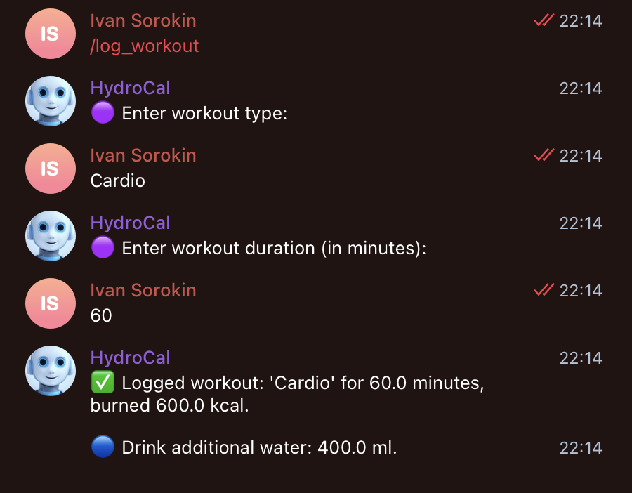
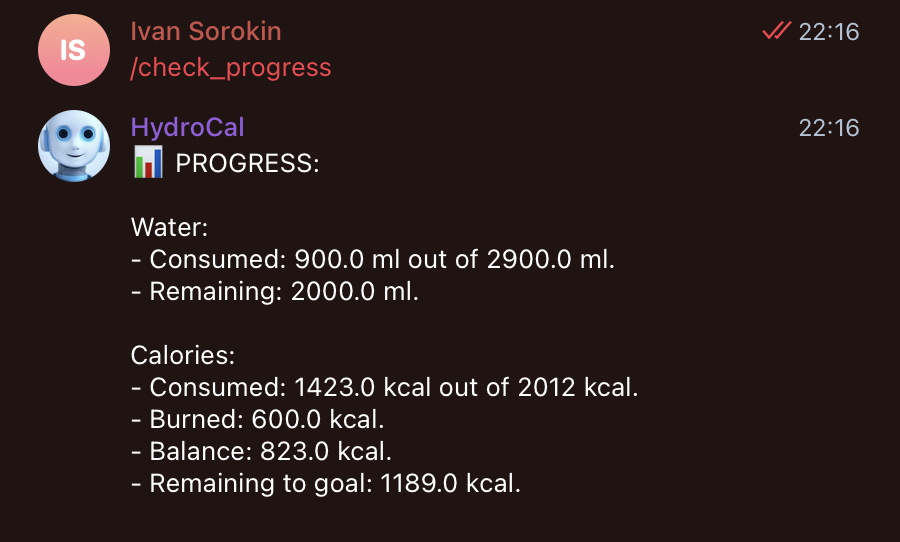

# hydro-cal-bot

## Project

HydroCal (@HydroCalBot) is a Telegram bot that helps users calculate their personalized daily water and calorie needs and track their workouts and meals. The bot uses user profile data along with external information (weather data, nutritional data) to provide accurate recommendations and interactive logging.

## Completed Tasks

### 1. Personalized Daily Needs Calculation:
- Calculated daily water intake using the formula:  
  **Base water = weight (kg) × 30 ml**  
  **Additional water = extra for physical activity (500 ml per 30 minutes) and hot weather (>25°C)**
- Calculated daily calorie needs using a formula similar to the Harris-Benedict equation with added calories for physical activity.
- Integrated with OpenWeatherMap API to adjust water needs based on the current temperature.
- Integrated with a food API (e.g., OpenFoodFacts) to retrieve nutritional data for accurate calorie tracking.

### 2. Logging and Tracking:
- Implemented commands for setting up a user profile (`/set_profile`), logging water (`/log_water`), logging food (`/log_food`), and logging workouts (`/log_workout`).
- Developed interactive, multi-step conversations for each logging command to enhance user experience (e.g., prompting for water amount, product name and grams, workout type and duration).
- Persisted user data in a local JSON file (`users.json`), including profile details, logged water, calories, and calories burned.

### 3. Interactive Telegram Bot:
- Built the bot using `aiogram` for asynchronous command handling.
- Provided a custom inline keyboard and a persistent bot command menu for easy navigation.
- Implemented a progress report command (`/check_progress`) that displays current water intake, calorie consumption, calories burned, and remaining goals.

## Data Used

User data is stored in a JSON file (`users.json`) and includes the following fields:
- `weight`: User's weight (in kg)
- `height`: User's height (in cm)
- `age`: User's age
- `activity`: Minutes of physical activity per day
- `city`: User's city (used for weather-based adjustments)
- `water_goal`: Calculated daily water intake goal
- `calorie_goal`: Calculated daily calorie target
- `logged_water`: Total water consumed
- `logged_calories`: Total calories consumed
- `burned_calories`: Calories burned through workouts

## Technologies and Tools

- **Programming Language:** Python
- **Libraries:** aiogram, requests, asyncio, json
- **APIs:** OpenWeatherMap, OpenFoodFacts (or equivalent)
- **Deployment:** Docker for containerized deployment; local execution for testing

## Results

- Developed a fully functional Telegram bot for tracking daily water, calorie intake, and workouts.
- Provided personalized recommendations based on user input and external API data.
- Implemented interactive, multi-step logging for water, food, and workouts to improve user experience.
- Persisted data locally in a JSON file, enabling accurate progress reports.
- The solution is containerized with Docker and ready for deployment on an online server.

## Demo

Below are some screenshots of the working bot in action:

- **Pre-start:**
  
  
  
- **Start:**

  
  
- **Profile Setup:**

  
  
  
- **Water Logging:**

  

- **Food Logging:**

  
  

- **Workout Logging:**

  

- **Progress Report:**

  

## Obtaining OpenWeatherMap API

1. Visit [OpenWeatherMap](https://openweathermap.org/)
2. Create an account
3. Retrieve your API KEY from "My API keys"

## Running Locally
1. Install dependencies:
pip install -r requirements.txt
2. Set the bot token in the config.py file or use environment variables.
3. Start the bot:
python bot.py

## Bot commands
- `/start` - greetings
- `/set_profile` - user profile set up
- `/log_water` - log in the amount of consumed water (in ml.)
- `/log_food` - enter the name of consumed product and the amout (in gr.)
- `/log_workout` - enter workout type and workout duration (in min.)
- `/check_progress` - check daily progress
